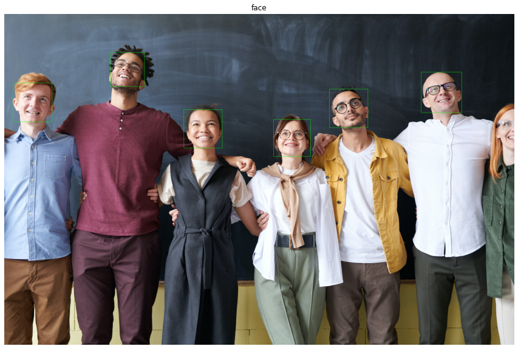

The provided Python code uses the OpenCV library and the Haar Cascade classifier to detect faces in an image. It then draws rectangles around the detected faces and displays the result using matplotlib.

  

Here's a breakdown of what the code does:

1. Import the required libraries:
   - `cv2`: OpenCV library for image processing and computer vision tasks.
   - `matplotlib.pyplot` as `plt`: Matplotlib for displaying the image.

2. Set the `imagePath` variable to the path of the image you want to process.

3. Read the image using `cv2.imread()` and convert it to grayscale using `cv2.cvtColor()`.

4. Load the Haar Cascade classifier for face detection using `cv2.CascadeClassifier()`.

5. Detect faces in the grayscale image using `faceCascade.detectMultiScale()`. The function takes several parameters:
   - `gray`: The grayscale image.
   - `scaleFactor`: Parameter specifying how much the image size is reduced at each image scale. A smaller value will increase the detection time but improve the accuracy.
   - `minNeighbors`: Parameter specifying how many neighbors each candidate rectangle should have to retain it. A higher value means fewer detections but with higher quality.
   - `minSize`: Minimum possible object size. Objects smaller than this will not be detected.

6. Print the number of faces found in the image.

7. Draw rectangles around the detected faces using `cv2.rectangle()`. This function takes the image, the top-left and bottom-right coordinates of the rectangle, the color of the rectangle (in BGR format), and the line thickness.

8. Display the image with the rectangles using matplotlib.

Note: The code assumes that the Haar Cascade classifier XML file for face detection, "haarcascade_frontalface_default.xml," is available in the OpenCV data directory. Ensure you have OpenCV installed correctly and that the XML file is present in the expected location.

If you have an image named "image1.jpg" and the Haar Cascade classifier XML file in the correct location, this code will display the image with rectangles around the detected faces using matplotlib.
